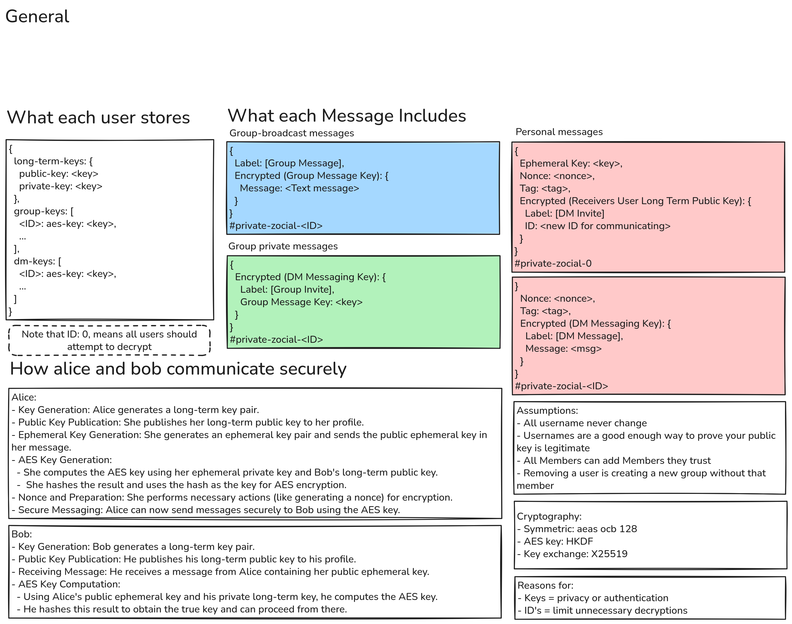

# Private Zocial
A crypto key management system that wraps mastadon written in zig

## How to run:
`$ git clone https://github.com/ThomasCreagh/private-zocial`
`$ zig build`
`$ ./zig-out/bin/private_zocail`

## About the Project
In scope:
- wrap a social media site
- allow users to key exchange
- be able to message indiviuals with encryption
- be able to create groups and message with encrytion
- give messages ids to allow clients not to have to attempt to decrypt all messages

Not in scope:
- security on client device
- public keys with valid certs etc
- was planning to have admins to control members who can join but everyone can leak the key so I think just give the key to all and trust them all. If people decide to remove someone just invite others to a new group.

Future could-do:
- Make it easy to create a group without one memeber

Links:
- tui lib https://github.com/rockorager/libvaxis
- aes-128 https://mojoauth.com/encryption-decryption/aes-128-encryption--zig/#introduction-to-aes-128
- ecc-192 https://compile7.org/encryption-decryption/how-to-use-ecc-192-to-encrypt-and-decrypt-in-zig/#generating-ecc-192-key-pairs
